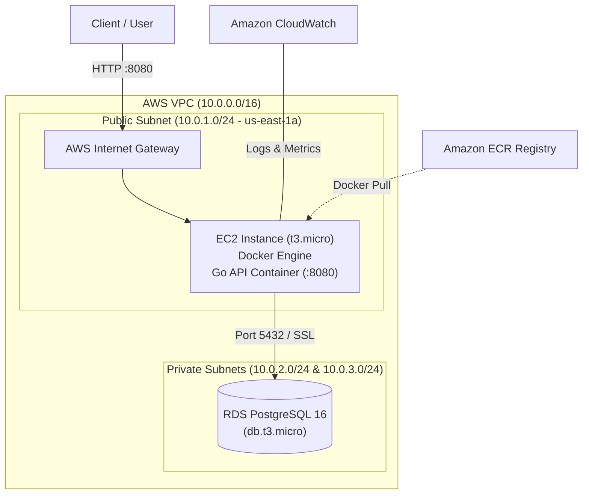

# AWS Cloud Platform — Automated Infrastructure & Go Microservices API


A production-ready, cloud-native backend platform and Infrastructure as Code (IaC) project built using **Go 1.26+**, **Docker**, **OpenTofu**, and **AWS Free Tier** services ($0/month cost model).

---

## 🏛️ Architecture Overview



---

## 🚀 Key Features

* **High-Performance Go API**: Framework-free REST API built strictly with standard library `net/http` (Go 1.22+ routing) and `database/sql`.
* **Zero-Downtime Containerization**: Multi-stage Docker build (`~18MB` image size) running as non-root (`1000:1000`) with HEALTHCHECK instructions.
* **Self-Migrating Database**: Auto-runs embedded SQL migrations (`//go:embed`) on boot using database connection pooling.
* **Infrastructure as Code (IaC)**: 100% reproducible OpenTofu / Terraform configuration provisioning VPC, Security Groups, ECR, RDS, IAM Roles, and EC2.
* **Automated CI/CD Pipeline**: GitHub Actions workflows for continuous integration (testing with `-race` detector, static analysis with `golangci-lint`) and continuous deployment to AWS with health check gates.
* **Cost Safety ($0/month)**: Architected strictly within the AWS Free Tier (NAT Gateway replaced with public subnet IGW routing for EC2 while keeping RDS strictly private).

---

## 📄 REST API Specification

| Method | Endpoint | Description |
| --- | --- | --- |
| `GET` | `/health` | Liveness probe (returns `200 OK`) |
| `GET` | `/ready` | Readiness probe (pings PostgreSQL database) |
| `GET` | `/metrics` | Operational metrics (active goroutines, uptime, Go version) |
| `POST` | `/services` | Create a new service resource |
| `GET` | `/services` | List all registered services |
| `GET` | `/services/{id}` | Get service details by ID |
| `PUT` | `/services/{id}` | Update existing service |
| `DELETE` | `/services/{id}` | Delete service resource |
| `POST` | `/services/{id}/deployments` | Register deployment under a service |
| `GET` | `/services/{id}/deployments` | List deployments for a service |

---

## 🛠️ Quickstart Guide

### 1. Run Locally with Docker Compose

```bash
# Clone the repository
git clone git@github.com:charbelbahry/aws-cloud-platform.git
cd aws-cloud-platform

# Spin up full stack (Go API + PostgreSQL)
docker compose up --build -d

# Verify application health
curl http://localhost:8080/health
curl http://localhost:8080/ready
```

### 2. Deploy Infrastructure to AWS with OpenTofu

```bash
# Configure AWS CLI profile
aws configure --profile clouddev

# Initialize OpenTofu providers
tofu -chdir=terraform init

# Preview execution plan
tofu -chdir=terraform plan

# Deploy to AWS
tofu -chdir=terraform apply
```

---

## 💵 AWS Free Tier Cost Model

| Resource | Configuration | Monthly Cost |
| --- | --- | --- |
| **Compute** | EC2 `t3.micro` (Amazon Linux 2023) | $0.00 (Free Tier 750 hrs) |
| **Database** | RDS PostgreSQL 16 `db.t3.micro` (20GB storage) | $0.00 (Free Tier 750 hrs) |
| **Registry** | Amazon ECR (10 image lifecycle retention policy) | $0.00 (Free Tier 500MB) |
| **Networking** | Internet Gateway + Public Subnet Route | $0.00 (NAT GW omitted) |
| **Monitoring** | CloudWatch Logs (14-day retention) + Alarms | $0.00 |

---

## 📜 License
Licensed under the [MIT License](LICENSE).
